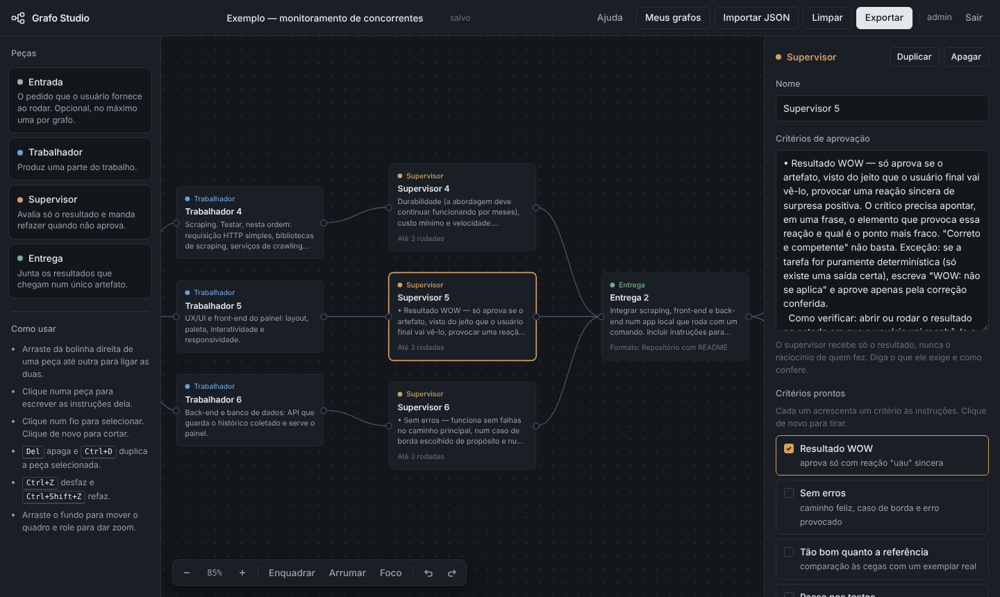
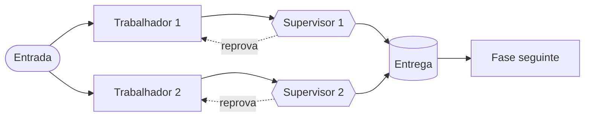
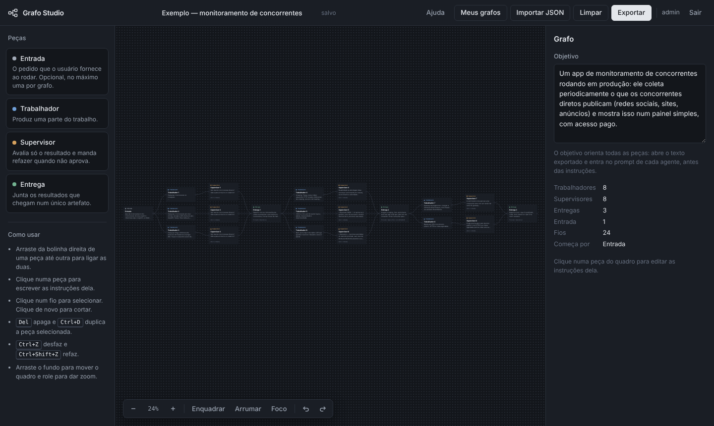
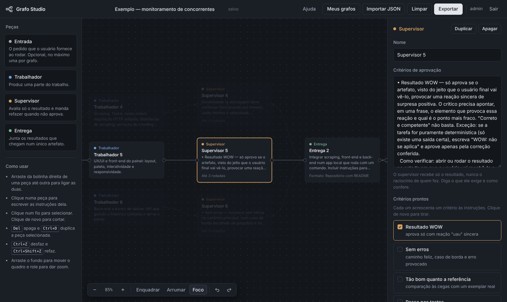
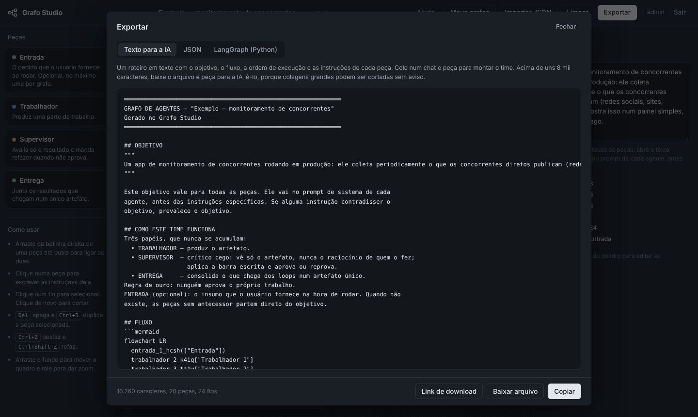
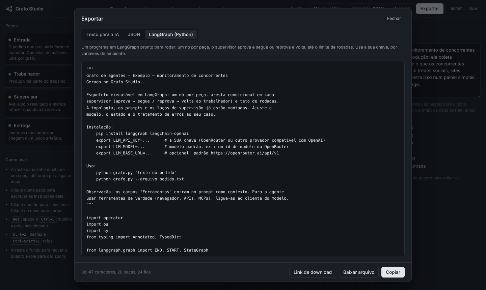
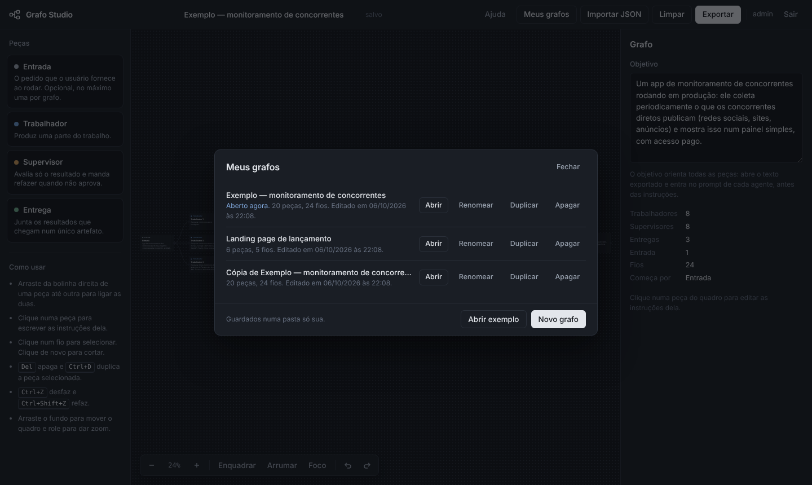
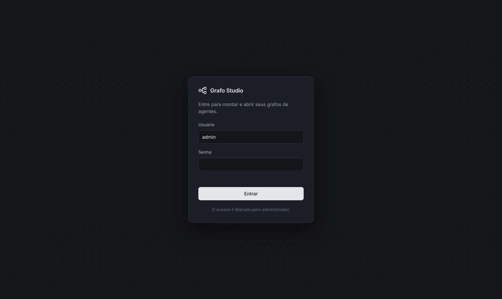
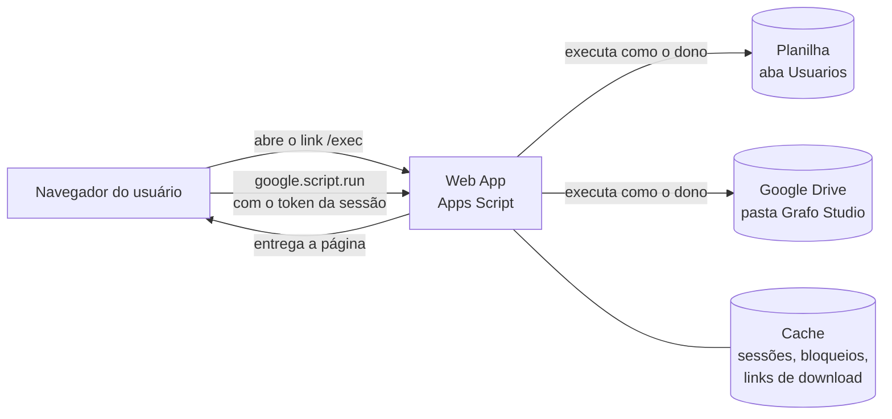

# Grafo Studio

Editor visual para montar times de agentes de IA como um grafo e exportá-los prontos para executar. Roda inteiro no Google Apps Script, como um Web App, e usa uma planilha e o Google Drive como banco de dados.



Você arrasta peças para um quadro, liga umas às outras e escreve as instruções de cada uma. No fim, o Grafo Studio gera um roteiro em texto para colar numa IA, o JSON do grafo ou um programa em Python (LangGraph) que executa o time.

**Versão atual:** 1.0.0

## Sumário

- [A ideia](#a-ideia)
- [Funcionalidades](#funcionalidades)
- [Telas](#telas)
- [Como funciona por dentro](#como-funciona-por-dentro)
- [Estrutura do repositório](#estrutura-do-repositório)
- [Publicação](#publicação)
- [Administração de usuários](#administração-de-usuários)
- [Exportações](#exportações)
- [Segurança](#segurança)
- [Desenvolvimento](#desenvolvimento)
- [Histórico de versões](#histórico-de-versões)
- [Autor](#autor)

## A ideia

Um agente de IA sozinho tende a aprovar o próprio trabalho. O Grafo Studio organiza o trabalho em **loops**: uma peça produz, outra avalia só o resultado e manda refazer até ele passar nos critérios. Vários loops rodam em paralelo, e uma peça de entrega junta os resultados, que podem alimentar a fase seguinte.

São quatro tipos de peça:

| Peça | Papel |
|---|---|
| **Entrada** | O pedido que o usuário fornece ao rodar. Opcional, no máximo uma por grafo. |
| **Trabalhador** | Produz uma parte do trabalho. As instruções dele viram o prompt de sistema do agente. |
| **Supervisor** | Recebe só o resultado, nunca o raciocínio de quem fez, e aprova ou reprova pelos critérios escritos. Se reprovar, o Trabalhador refaz, até um limite de rodadas. |
| **Entrega** | Junta os resultados que chegam num único artefato, que pode virar o insumo da fase seguinte. |

Um grafo típico tem esta forma:



A volta do Supervisor para o Trabalhador é automática: não é preciso desenhar esse fio.

## Funcionalidades

**Editor**
- Quadro com zoom, movimento livre, botão para enquadrar o grafo inteiro e organização automática em colunas ("Arrumar").
- Peças arrastáveis, ligações por arrastar e corte de fios com um clique.
- Modo **Foco**, que destaca só a cadeia da peça selecionada.
- Desfazer e refazer (até 100 passos), duplicar e apagar com atalhos de teclado.
- **Critérios prontos** para Supervisores: resultado "uau", sem erros, tão bom quanto a referência e passa nos testes.
- Campos avançados por peça: modelo de IA e ferramentas. O editor avisa quando algo colado parece uma chave secreta.
- Painel **Antes de exportar**, que aponta peças soltas, sem instruções ou sem saída, e Supervisores sem quem refazer.

**Grafos**
- Salvamento automático no Drive, numa pasta exclusiva por usuário.
- **Meus grafos**: abrir, renomear, duplicar e apagar.
- Importação de JSON, com validação e mensagens de erro claras.
- Rascunho local: se a aba fechar antes de salvar, o app oferece recuperar as alterações na próxima vez.

**Exportação**
- Roteiro em texto para a IA, JSON completo e programa em Python com LangGraph.
- Copiar, baixar o arquivo ou gerar um link de download temporário.

**Acesso**
- Login próprio, com usuários cadastrados numa aba da planilha. O usuário nunca vê a planilha nem o Drive.

## Telas

### Visão geral

O grafo de exemplo, um app de monitoramento de concorrentes em três fases, enquadrado no quadro:



### Modo Foco

Com uma peça selecionada, o Foco apaga tudo o que não faz parte da cadeia dela:



### Exportar

Três formatos, com a contagem de caracteres, peças e fios:





### Meus grafos



### Login



## Como funciona por dentro



- O Web App é publicado com **"Executar como: Eu"**. Todo acesso à planilha e ao Drive acontece com a conta do dono do app, nunca com a do usuário. É isso que mantém os usuários longe da planilha.
- O login devolve um **token de sessão** que vale 6 horas e se renova a cada uso. Toda função do servidor confere o token e se o usuário ainda existe na planilha.
- Cada grafo é um arquivo `.grafo.json` no Drive do dono, dentro de uma subpasta por usuário.
- A página é um único arquivo HTML, com CSS e JavaScript embutidos e sem bibliotecas externas além da fonte. Fora do Google, ela funciona em **modo local**, salvando no próprio navegador, o que facilita testar a interface.

## Estrutura do repositório

```
.
├── README.md
├── docs/                    imagens deste README
└── apps-script/
    ├── Code.js              servidor: login, sessão, usuários, Drive e download
    ├── Index.html           interface: editor, exportadores e janelas
    ├── appsscript.json      configuração do projeto e do Web App
    └── .clasp.json          liga a pasta ao projeto do Apps Script (usado pelo clasp)
```

## Publicação

### Requisitos

- Uma conta Google.
- [Node.js](https://nodejs.org) (versão LTS) e o [clasp](https://github.com/google/clasp), a ferramenta oficial para enviar código ao Apps Script.

### 1. Preparar o clasp

```bash
npm install -g @google/clasp
clasp login
```

Ative também a **API do Google Apps Script** em <https://script.google.com/home/usersettings>.

### 2. Criar a planilha e ligar o projeto

1. Crie uma planilha no Google Sheets e abra **Extensões > Apps Script**.
2. Em **Configurações do projeto** (ícone de engrenagem), copie o **ID do script**.
3. Clone este repositório e, dentro de `apps-script`, troque o `scriptId` do `.clasp.json` pelo ID copiado.
4. Envie o código:

```bash
cd apps-script
clasp push
```

### 3. Rodar a configuração inicial

No editor do Apps Script, recarregue a página, escolha a função **`configurar`** e clique em **Executar**. Autorize o acesso quando o Google pedir.

Ela cria a aba `Usuarios` e o usuário **admin** com uma senha aleatória. A senha aparece **só no registro de execução**, então anote-a.

### 4. Publicar o Web App

**Implantar > Nova implantação > App da Web**:

| Campo | Valor |
|---|---|
| Executar como | **Eu** |
| Quem pode acessar | **Qualquer pessoa** |

O link que termina em `/exec` é o endereço do app. Qualquer pessoa com ele vê a tela de login, mas só entra quem está cadastrado na aba `Usuarios`.

### Atualizar uma versão publicada

Depois de cada `clasp push`: **Implantar > Gerenciar implantações > editar (lápis) > Versão: Nova versão > Implantar**. O endereço `/exec` continua o mesmo.

> Não use "Nova implantação" para atualizar: ela gera um endereço diferente.

## Administração de usuários

Os usuários ficam na aba `Usuarios` da planilha:

| ID | Usuário | Senha | Chave interna (não editar) |
|---|---|---|---|
| 1 | admin | `h1$3f9a…$Xk2…` | `a1b2c3d4-…` |
| 2 | maria | `h1$7c1e…$Qp8…` | `e5f6a7b8-…` |

| Para… | Faça |
|---|---|
| Criar um usuário | Numa linha nova, preencha **Usuário** e **Senha**. A senha é embaralhada assim que você confirma a célula, e a Chave interna é preenchida sozinha. |
| Trocar uma senha | Apague o conteúdo da célula **Senha** e digite a nova. |
| Remover um usuário | Apague a linha. As sessões abertas dele caem no próximo acesso. |
| Recuperar uma senha esquecida | Não é possível: o embaralhamento não pode ser desfeito. Defina uma nova. |

Regras importantes:

- **Não edite nem copie a coluna D (Chave interna).** É ela que liga cada pessoa à sua pasta de grafos. Se uma linha for copiada com a mesma chave, o app gera uma chave nova para a cópia.
- A coluna **ID** é só um rótulo. Pode repetir ou ser reaproveitada sem risco.
- Se uma senha aparecer em texto puro na planilha (o gatilho automático pode falhar em raros casos), ela é embaralhada no próximo login de qualquer pessoa ou ao rodar `configurar` de novo.

## Exportações

| Formato | Para quê |
|---|---|
| **Texto para a IA** | Um roteiro com o objetivo, o fluxo em Mermaid, a ordem de execução por níveis, as regras de execução e as instruções literais de cada peça. Cole num chat e peça para a IA montar o time. Acima de uns 8 mil caracteres, prefira baixar o arquivo e pedir para a IA lê-lo. |
| **JSON** | O grafo completo, para abrir de novo em **Importar JSON**, versionar ou usar em outro programa. |
| **LangGraph (Python)** | Um programa pronto para rodar: um nó por peça, aresta condicional em cada Supervisor (aprova e segue, ou reprova e volta) e limite de rodadas. |

Para rodar o programa em Python:

```bash
pip install langgraph langchain-openai
export LLM_API_KEY=...        # sua chave (OpenRouter ou outro provedor compatível com a API da OpenAI)
export LLM_MODEL=...          # modelo padrão
export LLM_BASE_URL=...       # opcional; padrão https://openrouter.ai/api/v1

python meu-grafo_grafo.py "texto do pedido"
python meu-grafo_grafo.py --arquivo pedido.txt
```

O resultado de cada Entrega final vai para `saida_<peça>.md`, e os pareceres dos Supervisores para `vereditos.md`.

Os botões da janela de exportação:

- **Copiar** copia o texto.
- **Baixar arquivo** baixa direto pelo navegador.
- **Link de download** é a alternativa quando o navegador bloqueia o download dentro do Apps Script. Gera um endereço temporário, válido por 10 minutos.

## Segurança

| Ponto | Como é tratado |
|---|---|
| Senhas | Nunca ficam em texto puro. São guardadas como HMAC-SHA256 repetido 100 vezes, com um **sal** aleatório por usuário e uma **pimenta** que fica só nas propriedades do script, fora da planilha. |
| Tentativas de login | Depois de 5 erros seguidos, o usuário fica bloqueado por 10 minutos. Cada erro também espera 0,8 segundo antes de responder. |
| Acesso aos dados | O app executa como o dono. Os usuários não recebem acesso à planilha nem ao Drive. |
| Isolamento entre usuários | Cada usuário tem uma pasta própria, escolhida pela Chave interna. Abrir, salvar ou apagar um grafo confere se o arquivo está na pasta de quem pediu. |
| Exportações | Ficam privadas no Drive do dono. O link de download usa um código aleatório de 64 caracteres e vence em 10 minutos. |
| Credenciais nos grafos | O editor avisa quando o campo de ferramentas parece conter uma chave secreta e orienta a escrever só o nome da variável de ambiente. |

> **Guarde as propriedades do script.** A pimenta fica em **Configurações do projeto > Propriedades do script**. Se ela for apagada, todas as senhas deixam de funcionar e precisam ser redefinidas na planilha.

## Desenvolvimento

### Fluxo de trabalho

1. Edite os arquivos de `apps-script/` no seu editor. Nunca edite pelo editor online: o próximo `clasp push` sobrescreve tudo sem aviso.
2. Envie com `clasp push` (dentro de `apps-script`).
3. Para testar sem publicar, use **Implantar > Testar implantações**. O endereço `/dev` sempre mostra o último `clasp push`, mas só abre para quem edita o projeto.
4. Publique uma nova versão quando estiver pronto (veja [Atualizar uma versão publicada](#atualizar-uma-versão-publicada)).

### Testar a interface localmente

Abra `apps-script/Index.html` direto no navegador. Sem o Google por perto, o app entra em **modo local**: não pede login e guarda os grafos no próprio navegador. O link de download não funciona nesse modo; o resto, sim.

### Organização do `Index.html`

O script da página é dividido em duas partes:

1. **Modelo** (`TIPOS`, `PRESETS`, `validate`, `normalizeGraph`, `layoutGraph`, `exportText`, `exportJSON`, `exportPython`, `buildExample`): funções puras sobre o grafo, sem depender da interface.
2. **Interface**: estado, comunicação com o servidor (`api`), login, histórico, salvamento automático, desenho do quadro, painel lateral, janelas e atalhos.

> Os textos de `PRESETS` são inseridos e removidos das instruções por correspondência exata. Alterá-los impede a remoção em grafos que já os contêm.

### Formato do grafo

```json
{
  "version": 1,
  "id": "ID do arquivo no Drive",
  "name": "Meu grafo",
  "objective": "O que o time precisa entregar",
  "nodes": [
    {
      "id": "trabalhador_2_ab12",
      "type": "trabalhador",
      "name": "Trabalhador 1",
      "instructions": "…",
      "position": { "x": 0, "y": 0 },
      "model": "opcional",
      "tools": "opcional"
    },
    {
      "id": "supervisor_3_cd34",
      "type": "supervisor",
      "name": "Supervisor 1",
      "instructions": "…",
      "max_rounds": 3,
      "presets": ["erros"],
      "position": { "x": 360, "y": 0 }
    }
  ],
  "edges": [
    { "id": "fio_trabalhador_2_ab12__supervisor_3_cd34", "source": "trabalhador_2_ab12", "target": "supervisor_3_cd34" }
  ]
}
```

Tipos de peça: `entrada`, `trabalhador`, `supervisor` e `entrega`. Peças do tipo `entrega` têm também o campo `format`. Na exportação em JSON, cada Supervisor ganha o campo `on_reject`, com os Trabalhadores que refazem quando ele reprova.

## Histórico de versões

### 1.0.0

Primeira versão publicada.

- Editor de grafos completo, com login próprio, salvamento no Drive e três formatos de exportação.
- Correção: desfazer durante o primeiro salvamento de um grafo novo criava um arquivo duplicado.
- Correção: o botão Enquadrar não mostrava grafos grandes por inteiro (zoom mínimo baixou de 25% para 10%).
- Segurança: senhas com hash, sal e pimenta, e bloqueio após 5 tentativas erradas.
- Segurança: pastas escolhidas por uma chave interna única, para que um ID reaproveitado não dê acesso aos grafos de outra pessoa.
- Segurança: exportações privadas, com link de download temporário em vez de link público.
- Rascunho local com recuperação de alterações não salvas.
- Novo visual escuro, fonte Geist e código reescrito.

## Autor

João Pedro S. Maciel ([@jopesmp](https://github.com/jopesmp))
